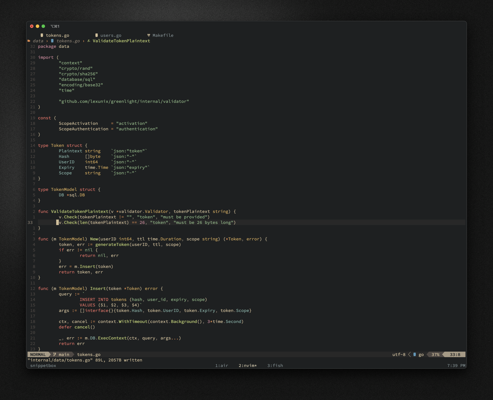

# Personal dotfiles



The repository includes configuration files for:

- neovim
- fish
- tmux
- git

## Neovim

LSP is set up with the following plugins:

- [nvim-lspconfig](https://github.com/neovim/nvim-lspconfig)
- [mason.nvim](https://github.com/williamboman/mason.nvim)
- [mason-lspconfig.nvim](https://github.com/williamboman/mason-lspconfig.nvim)
- [null-ls.nvim](https://github.com/jose-elias-alvarez/null-ls.nvim)
- [lspsaga.nvim](https://github.com/nvimdev/lspsaga.nvim)
- [lspkind-nvim](https://github.com/onsails/lspkind.nvim)
- [nvim-cmp](https://github.com/hrsh7th/nvim-cmp) and [cmp-nvim-lsp](https://github.com/hrsh7th/cmp-nvim-lsp)

Mason is handling all the LSP configurations for Go, Rust, TypeScript, Python, etc.
Null-ls is mainly used for formatting.

To install LSP run:

```sh
:LspInstall
```

Config also includes:

- [telescope.nvim](https://github.com/nvim-telescope/telescope.nvim)
- [treesitter](https://github.com/nvim-treesitter/nvim-treesitter) with additional query injections for Go, TypeScript, and Markdown
- [vim-fugitive](https://github.com/tpope/vim-fugitive)
- [lualine.nvim](https://github.com/nvim-lualine/lualine.nvim)
- [nvim-dap](https://github.com/mfussenegger/nvim-dap)
- [nvim-bufferline](https://github.com/akinsho/bufferline.nvim)

Currrent colorscheme is [gruvbox-material](https://github.com/sainnhe/gruvbox-material) by sainnhe.

## Fish

I use fisher as a plugin manager. Here are my installed plugins:

- jorgebucaran/fisher
- edc/bass
- fabioantunes/fish-nvm
- ilancosman/tide@v5
- jethrokuan/z
- patrickf1/fzf.fish

## Git

Git configuration includes [delta](https://github.com/dandavison/delta), a syntax-highlighting
pager for git and useful aliases i borrowed from [craftzdog](https://github.com/craftzdog).
