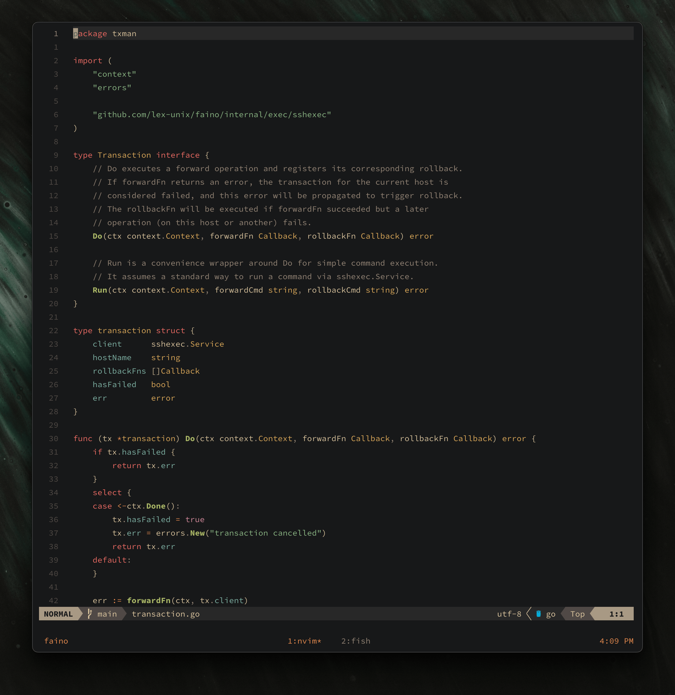

# Personal dotfiles

This repository contains configuration for neovim, fish, tmux. Most of the configuration is managed through nix.

## Neovim

- **LSP**: `nvim-lspconfig`, `mason.nvim`, `mason-lspconfig.nvim`
- **Completion**: `blink.cmp`
- **Formatting**: `conform.nvim`
- **UI**: `telescope.nvim`, `lualine.nvim`, `bufferline.nvim`
- **DAP**: `nvim-dap`
- **Syntax**: `treesitter` with custom queries for Go, TypeScript, Markdown
- **Themes**:
    - Dark: [gruvbox-material](https://github.com/sainnhe/gruvbox-material)
    - Light: [github-nvim-theme](https://github.com/projekt0n/github-nvim-theme)

## Fish Shell

- Managed via home-manager (`nix-darwin/modules/home-manager/fish.nix`)
- Plugins:
    - [`patrickf1/fzf.fish`](https://github.com/patrickf1/fzf.fish)
- Custom aliases and functions for tmux sessionizing, path management, and more

## Tmux

- Managed via home-manager (`nix-darwin/modules/home-manager/tmux.nix`)
- Vi key mode, custom status line, themed colors, and sensible keybindings

## Git

- Managed via home-manager (`nix-darwin/modules/home-manager/git.nix`)
- Uses [delta](https://github.com/dandavison/delta) for diffs, many useful aliases, and `nvim` as the diff/merge tool

## Ghostty

- Config in `ghostty/config`
- Custom font, padding, theme, and macOS-specific tweaks

## Legacy configuration

The branch `before-nix-darwin` contains my previous dotfiles setup, before migrating to Nix.
You may find it useful for reference, comparison, or if you want to see how things were managed without Nix.
